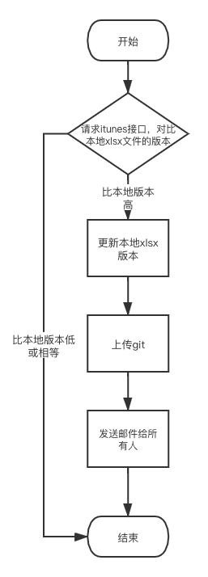

# AppStoreSendEmail

中文文档：[中文文档](./README_zh.md)
Run the python beautiful script, and automatically send an email reminder to you when the app is approved

### how to use?

- First install python dependent library
```python
python3 setup.py build
python3 setup.py install
```

- Enter `./run/` directory to edit `input.xlsx`, (Configure mail sender information and some configuration parameters of `app`)

- Execute script
```python
cd run/
python3 run.py
```

## Flow

