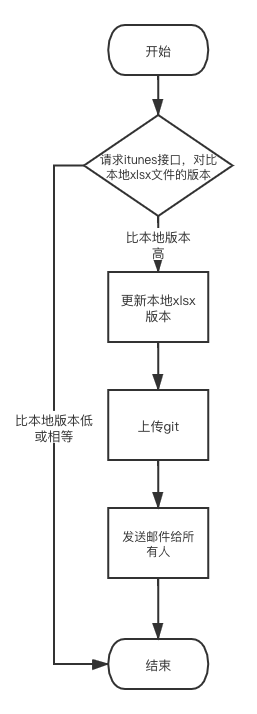

# AppStoreSendEmail

自动检查app版本并自动发送邮件脚本

### 如何使用？

- 首先安装python依赖库
```python
python3 setup.py build
python3 setup.py install
```

- 进入`./run/`目录下编辑`input.xlsx`，（配置邮件收发者信息及`app`一些配置参数）

- 执行脚本
```python
cd run/
python3 run.py
```

### 流程




